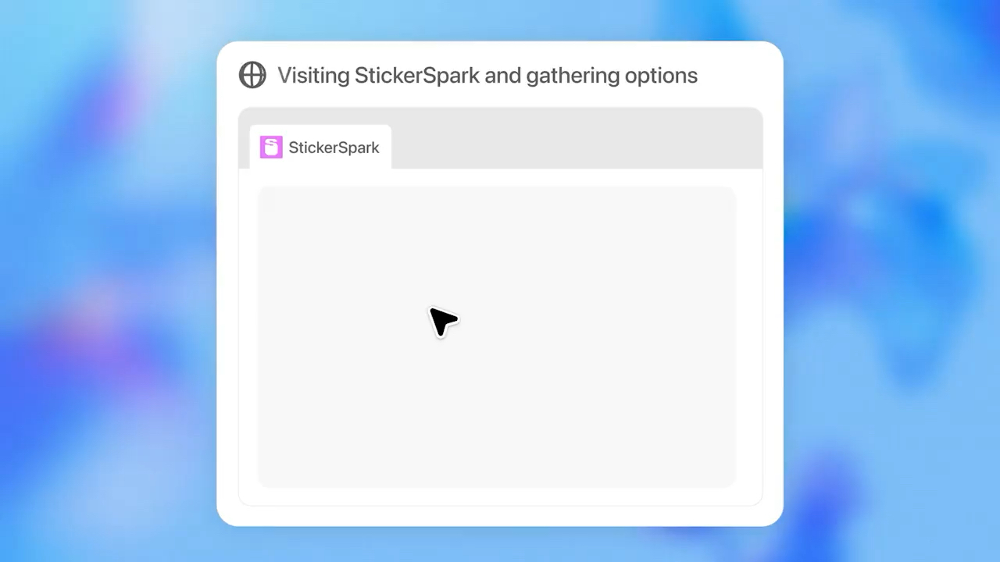

<p align="center">
  
</p>

# MSc Thesis – AI Robustness in Digital Forensics

## Evaluating the Robustness of AI-Based Forensic Tools under Adversarial and Anti-Forensic Attacks

This repository contains the frozen research artifact for an MSc thesis in **Computer Engineering, Cybersecurity and Artificial Intelligence**.

The thesis evaluates the **operational robustness of AI-based image-classification and media-triage systems in Digital/Computer Forensics**. The workflow compares transparent proxy models and commercial black-box tools under clean inputs, out-of-distribution samples, adversarial perturbations, and anti-forensic transformations.

---

## Frozen status

| Area | Status | Main artifacts |
|---|---|---|
| Dataset construction | Completed | `datasets/` |
| Proxy model training and evaluation | Completed | `models/`, `evaluation/proxy_models/`, `results/metrics/` |
| Perturbation generation | Completed | `attacks/` |
| Forensic evaluation bundle | Generated and validated | `datasets/forensic_evaluation_bundle/` |
| Commercial-tool normalization | Completed | `evaluation/forensic_tools/`, `forensic_tools/` |
| XAI case studies | Completed | `explainability/` |
| Thesis source | Completed and frozen | `docs/LatexThesis/` |

---

## Official dataset artifacts

Official frozen dataset:

```text
datasets/final/manifests/manual_selection_final_1500.csv
```

Official binary subset:

```text
datasets/final/manifests/manual_selection_adversarial_subset.csv
```

Out-of-distribution samples remain separate from proxy training and adversarial generation. They are evaluated as an operational robustness risk.

---

## Forensic evaluation bundle

For black-box forensic-tool evaluation, import only:

```text
datasets/forensic_evaluation_bundle/blind_tool_input/files/
```

Do not import:

```text
datasets/forensic_evaluation_bundle/metadata/
datasets/forensic_evaluation_bundle/structured_audit_view/
```

Those directories contain ground-truth labels, perturbation metadata, source information, and hash mappings. They are reserved for post-export normalization and audit.

---

## Final commercial-tool perimeter

| Tool | Version / module | Role |
|---|---|---|
| Magnet AXIOM / Magnet.AI | 10.1.0.48673 | Commercial forensic AI categorization |
| Excire Foto 2025 | 4.1.5 | Standalone AI-assisted semantic image retrieval |
| Cellebrite Inseyets | 10.9 | Commercial black-box AI-assisted media analysis |
| Magnet Griffeye / T3K CORE | Griffeye x64 26.2.108, T3K CORE 1.18.0 | Commercial forensic media triage and semantic bookmarking |

Official normalization entry point:

```text
evaluation/scripts/19_normalize_forensic_ai_tool_predictions.py
```

---

## Official script sequence

```text
00_download_raw_datasets_bundle.py
01_download_kaggle.py
02_download_github.py
03_build_subset_deepfirearm.py
04_scrape_google.py
05_scrape_telegram.py
06_scrape_youtube.py
07_scrape_deepweb.py
08_build_prepared_dataset.py
09_generate_review_manifest_full.py
10_manual_selection_protocol_reviewer.py
11_generate_clean_and_ood_splits.py
12_train_proxy_models.py
13_generate_anti_forensic_attacks.py
14_generate_adversarial_attacks.py
15_evaluate_proxy_models.py
16_build_forensic_evaluation_bundle.py
17_generate_integrated_gradients_case_studies.py
18_xai_interactive_launcher.py
19_normalize_forensic_ai_tool_predictions.py
```

---

## Repository structure

```text
msc-thesis-ai-robustness-in-digital-forensics/
├── datasets/
├── attacks/
├── models/
├── evaluation/
├── explainability/
├── forensic_tools/
├── results/
├── docs/
├── progress/
├── CITATION.cff
├── DATA_ACCESS.md
├── SECURITY.md
├── REPRODUCIBILITY.md
├── ACADEMIC_REPOSITORY_AUDIT.md
├── .env.example
├── requirements.txt
└── LICENSE
```

---

## Data access and reproducibility

The repository does **not** expose public raw dataset download links. Controlled restoration uses:

```text
FAIRLAB_RAW_DATASET_BUNDLE_URL
```

See:

- `DATA_ACCESS.md` for controlled raw dataset access;
- `.env.example` for safe local environment variable names;
- `REPRODUCIBILITY.md` for the reproducibility workflow;
- `SECURITY.md` for secret and data-exposure handling.

---

## Citation

Citation metadata are provided in:

```text
CITATION.cff
```

---

## License

The repository code is distributed under the MIT License. Raw datasets, third-party images, commercial forensic-tool exports, and controlled-access bundles are not covered by unrestricted redistribution unless explicitly stated.
