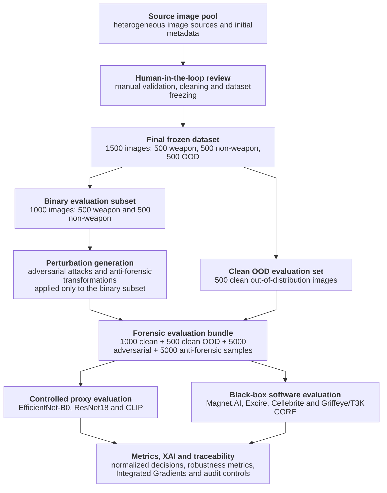

<p align="center">
  
</p>

# MSc Thesis – AI Robustness in Digital Forensics

## Evaluating the Robustness of AI-Based Forensic Tools under Adversarial and Anti-Forensic Attacks


This repository contains the frozen research artifact supporting an MSc thesis in **Computer Engineering, Cybersecurity and Artificial Intelligence** at the University of Cagliari.

The study evaluates the **operational robustness of AI-based image-classification and media-triage systems in Digital/Computer Forensics** under clean inputs, out-of-distribution samples, adversarial perturbations, and anti-forensic transformations. It compares transparent proxy models with observable outputs from selected commercial black-box tools.

The repository is a research artifact, not a general-purpose forensic classifier, unrestricted dataset release, or operational investigative system.

---

## At a Glance

| Component | Description |
|---|---|
| Research focus | Robustness of AI-based forensic image classification and media triage |
| Frozen dataset | 500 weapon + 500 non-weapon + 500 OOD images |
| Evaluation bundle | 11,500 files |
| Proxy models | EfficientNet-B0, ResNet18, CLIP-based visual proxy |
| Commercial tools | Magnet AXIOM / Magnet.AI, Excire Foto 2025, Cellebrite Inseyets, Griffeye / T3K CORE |
| Conditions | Clean, OOD, adversarial, anti-forensic |
| Public prediction outputs | 69,000 sanitized commercial-tool decisions |
| Main quantitative outputs | Proxy metrics, 186 commercial metric rows, reporting figures and tables |
| XAI | Five Integrated Gradients case studies selected for Chapter 5 |
| Data policy | Controlled access; image corpora and complete raw exports are not distributed on `main` |

---

## Research Objective

> How robust are AI-based forensic image-classification and media-triage systems when exposed to realistic adversarial and anti-forensic input manipulations?

The evaluation uses three complementary perspectives:

1. **Transparent proxy evaluation** — fold-aware training and controlled robustness analysis with known model architectures.
2. **Commercial black-box evaluation** — blind processing followed by post-export normalization against hidden ground truth.
3. **Operational risk analysis** — false negatives, false positives, OOD forced classification, confidence behavior, traceability, and human-review implications.

---

## Experimental Workflow



The 1,500-image dataset is the methodological source dataset. The 11,500-file bundle consists of 1,000 clean binary images, 500 clean OOD images, 5,000 adversarial samples, and 5,000 anti-forensic samples.

---

## Canonical Public Artifacts

### Dataset and bundle

```text
datasets/final/manifests/manual_selection_final_1500.csv
datasets/final/manifests/manual_selection_adversarial_subset.csv
datasets/splits/manifests/clean_folds_manifest.csv
datasets/splits/manifests/ood_eval_manifest.csv
datasets/forensic_evaluation_bundle/metadata/bundle_manifest.csv
```

### Proxy evaluation

```text
evaluation/proxy_models/proxy_model_predictions.csv
results/metrics/final_core_metrics.csv
results/metrics/final_robustness_metrics.csv
results/metrics/final_confusion_matrices.csv
results/metrics/final_ood_metrics.csv
```

### Commercial-tool evaluation

```text
evaluation/forensic_tools/normalized_predictions.csv
evaluation/forensic_tools/normalized_predictions_public_summary.json
forensic_tools/public_extracts_validation.json
results/metrics/forensic_tools_metrics.csv
```

The canonical commercial table contains exactly **69,000 sanitized decisions** across six configurations. The validation report confirms equivalence with the four tool-specific extracts and with all **186 frozen metric rows**.

### XAI and reporting

```text
explainability/manifests/chapter5/thesis_selection.csv
results/figures/chapter_5/
docs/LatexThesis/images/
```

---

## Commercial-Tool Perimeter

| Tool | Version / module | Observable operational signal |
|---|---|---|
| Magnet AXIOM / Magnet.AI | 10.1.0.48673 | `Possible weapons` tag |
| Excire Foto 2025 | 4.1.5, D20/D50/D80 | membership in fixed firearm-oriented semantic prompt results |
| Cellebrite Inseyets | 10.9 / Physical Analyzer 10.9.0.3029 | exported weapon classifications |
| Magnet Griffeye / T3K CORE | Griffeye 26.2.108 / T3K CORE 1.18.0 | `CORE/Violence/Firearm` bookmark |

The thesis evaluates exported observable signals. It does not claim access to proprietary model architectures, thresholds, probabilities, weights, training data, or undocumented internal logic.

---

## Quick Navigation

| Document | Purpose |
|---|---|
| [`docs/artifact/THESIS_ARTIFACT.md`](docs/artifact/THESIS_ARTIFACT.md) | Official thesis-artifact scope and source-of-truth statement |
| [`docs/artifact/REPOSITORY_MAP.md`](docs/artifact/REPOSITORY_MAP.md) | Directory-level repository map |
| [`docs/artifact/ARTIFACT_EVALUATION.md`](docs/artifact/ARTIFACT_EVALUATION.md) | Public audit and reproducibility levels |
| [`docs/artifact/DATA_DICTIONARY.md`](docs/artifact/DATA_DICTIONARY.md) | CSV/JSON field interpretation |
| [`docs/artifact/ENVIRONMENT.md`](docs/artifact/ENVIRONMENT.md) | Environment and dependency assumptions |
| [`docs/artifact/REPRODUCIBILITY.md`](docs/artifact/REPRODUCIBILITY.md) | Controlled reproducibility workflow |
| [`docs/artifact/DATA_ACCESS.md`](docs/artifact/DATA_ACCESS.md) | Controlled data-access procedure |
| [`.github/SECURITY.md`](.github/SECURITY.md) | Secret, proprietary-data, and exposure policy |
| [`docs/maintenance/ACADEMIC_REPOSITORY_AUDIT.md`](docs/maintenance/ACADEMIC_REPOSITORY_AUDIT.md) | Academic repository audit record |
| [`docs/maintenance/RELEASE_CHECKLIST.md`](docs/maintenance/RELEASE_CHECKLIST.md) | Final release and DOI checklist |
| [`docs/artifact/ARCHIVE_SNAPSHOT.md`](docs/artifact/ARCHIVE_SNAPSHOT.md) | Immutable pre-cleanup snapshot documentation |
| [`CHANGELOG.md`](CHANGELOG.md) | Release-oriented change history |

---

## Repository Structure

```text
msc-thesis-ai-robustness-in-digital-forensics/
├── .github/           # Security policy and lightweight CI audit
├── attacks/           # Perturbation manifests and local-output boundaries
├── datasets/          # Dataset manifests, metadata and numbered pipeline scripts
├── docs/              # Artifact docs and authoritative LaTeX thesis source
├── evaluation/        # Proxy and commercial-tool predictions / normalization
├── explainability/    # XAI scripts and canonical thesis-selection manifest
├── forensic_tools/    # Tool-specific sanitized extracts and run registry
├── models/            # Proxy checkpoints, model card, registry and training code
├── results/           # Frozen metrics, reporting assets and validators
├── tools/             # Local repository and LaTeX audit helpers
├── CHANGELOG.md
├── CITATION.cff
├── LICENSE
└── requirements.txt
```

---

## Controlled Reproducibility

The public repository supports structural audit, code review, manifest inspection, metric recomputation from committed sanitized decisions, reporting validation, and thesis-source review.

Full end-to-end reruns require controlled image access. Commercial-tool reruns additionally require compatible licensed software. For black-box processing, import only the blind input view and never the metadata or structured audit views.

Controlled restoration and reproducibility instructions are documented in:

- [`docs/artifact/DATA_ACCESS.md`](docs/artifact/DATA_ACCESS.md)
- [`docs/artifact/REPRODUCIBILITY.md`](docs/artifact/REPRODUCIBILITY.md)
- [`docs/artifact/ENVIRONMENT.md`](docs/artifact/ENVIRONMENT.md)
- [`.env.example`](.env.example)

---

## Validation Commands

```bash
python forensic_tools/scripts/validate_public_extract_equivalence.py \
  --source evaluation/forensic_tools/normalized_predictions.csv \
  --metrics results/metrics/forensic_tools_metrics.csv \
  --force

python explainability/scripts/validate_chapter5_xai_artifacts.py \
  --strict-thesis-text

python results/scripts/23_validate_results_artifacts.py
python results/scripts/24_audit_reporting_asset_usage.py --strict
python tools/latex/audit_latex_images_used.py --main docs/LatexThesis/main.tex
```

The GitHub Actions workflow under `.github/workflows/repository-audit.yml` performs lightweight file, JSON, Python syntax, canonical-prediction, and documentation-guard checks.

---

## Historical Preservation

The current `main` branch is authoritative. The complete pre-cleanup state is preserved for provenance through:

```text
branch: archive/pre-commission-cleanup-2026-07-16
tag:    snapshot/pre-commission-cleanup-2026-07-16
commit: 309a4580537ebc3bb7950f29c090bb2729fc603b
```

The branch and annotated tag are protected against update, deletion, and force-push operations. Historical preservation does not grant permission to redistribute third-party images, controlled datasets, or proprietary commercial exports.

---

## Thesis Source

The authoritative LaTeX source is:

```text
docs/LatexThesis/
```

Local compilation products, including `main.pdf`, are ignored. A final PDF may be attached to a versioned GitHub release instead of being committed to the source tree.

---

## Citation and License

Citation metadata are provided in [`CITATION.cff`](CITATION.cff). Source code is distributed under the MIT License. Dataset rights, third-party images, proprietary exports, licensed tools, and controlled-access material remain subject to their own legal, ethical, and contractual restrictions.
